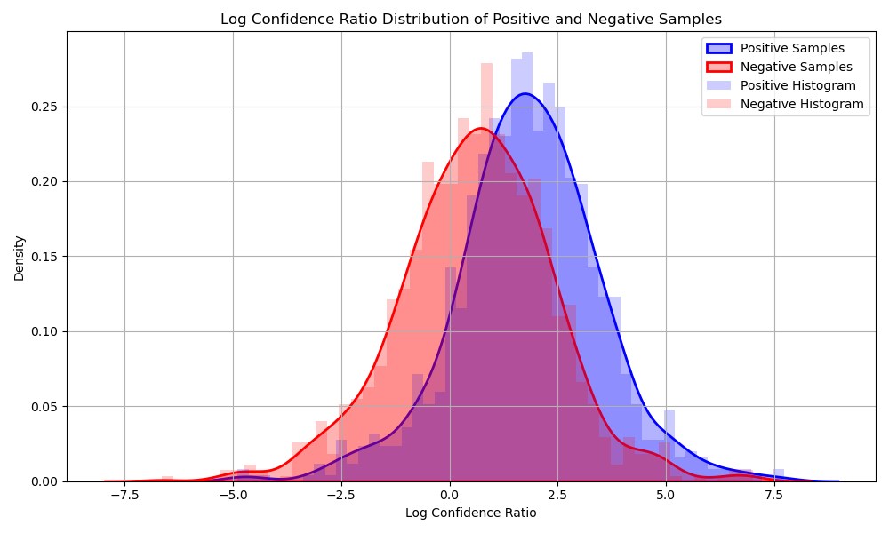
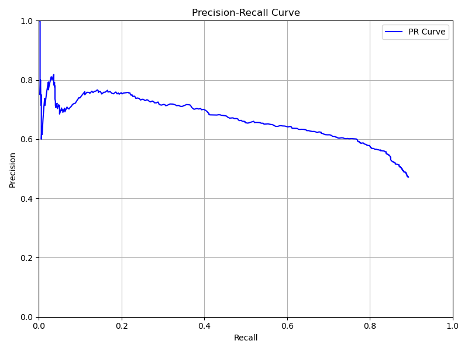
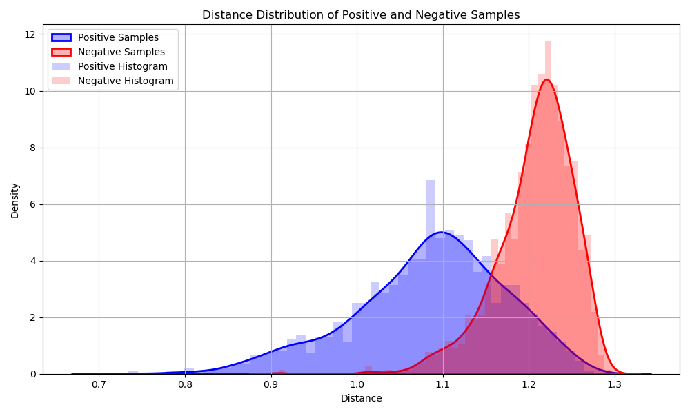
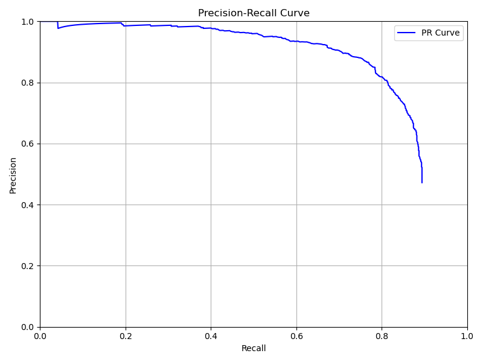
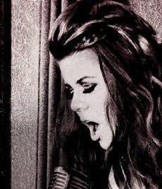
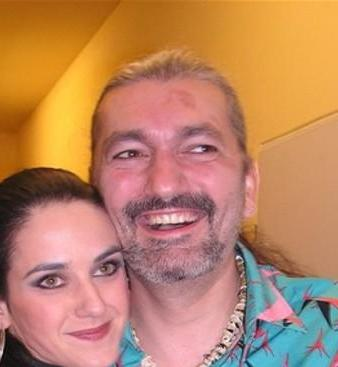

# 未命名

# 数据集处理

VGG Face2提供了9131个人物的共331万张图片，图片太多，需要筛选

我们随机挑选了1000个人物，每人10张图片作为训练的数据集。

1000个正样本（训练集中人物的不同图片），1000个负样本（不在训练集中人物）作为测试集

# 人脸识别流程

1. 构建特征库：

    使用`DeepFace.represent`​提取人脸特征向量。

    步骤：

    1. **人脸检测**：使用`RetinaFace`​检测图片中的人脸，并返回人脸框（`bbox`​）和关键点（如眼睛、鼻子、嘴角等）。
    2. **对齐**：根据检测到的关键点（如双眼位置）自动旋转人脸，使其水平对齐（这能提高后续特征提取的准确性）。
    3. **裁剪人脸区域**：根据检测到的 `bbox`​ 裁剪出人脸区域。
    4. **生成** **​`embedding`​**​ **特征向量**：根据裁剪出人脸区域，再输入到指定的模型（如 Facenet、ArcFace 等）生成 embedding。
2. 识别流程：

    1. **生成** **​`embedding`​**​ **特征向量**：与构建特征库中同样的步骤生成输入图片的embedding。
    2. **计算与特征库的相似度**：计算输入图片的embedding与特征库中各个人物所有图片特征的平均欧氏距离与标准差 **。**
    3. **计算置信度**：采用 **归一化 + 标准差加权** 的方式计算置信度，如果 `mean_distance`​ 接近 `min_d`​，则置信度接近 `1`​；如果 `std_distance`​ 较大，则置信度降低（表示该文件夹内人脸差异大）。

        ```undefined
        def distance_to_confidence(distance, std_dist, min_d, max_d, lambda_=1.0):
            # 计算置信度，使用线性归一化法计算置信度，引入标准差作为惩罚因子
            penalty = np.exp(-lambda_ * std_dist)
            norm = (distance - min_d) / max(max_d - min_d, 1e-6)
            return round((1 - norm) * penalty, 4)
        ```
    4. **排序并返回最相似结果**：最终返回 **最相似人物** 及其 **置信度比率**​**​`confidence_ratio`​**​ 和 **平均距离**​**​`distance`​**​，

        ​**​`confidence_ratio`​**​ 衡量 **第一名和第二名的差距是否显著**（值越大，识别越可靠）。

        ​**​`distance`​**​ 是查询图片与最相似文件夹的平均距离。

        这两个数据用于阈值过滤。

# 评价流程

1. 对于正例，正确识别作为`TP`​，识别错误或**​`confidence_ratio`​**​/**​`distance`​**​未达到阈值（视为特征库中不存在这个人）作为`FN`​；
2. 对于负例，**​`confidence_ratio`​**​/**​`distance`​**​未达到阈值（视为特征库中不存在这个人）作为`TN`​，达到阈值识别错误作为 `FP`​。
3. 对于人脸识别系统，将不在数据库中的人误识别是非常严重的问题，特别是在安全场景（如门禁系统、身份验证）中。

    所以使用F0.5-Score作为评价指标，惩罚 FP 更多。

    $F_{0.5} = \left(1 + \beta^2\right) \cdot \frac{P \cdot R}{\beta^2 \cdot P + R}, \quad \text{where } \beta = 0.5$

4. 具体流程：使用**​`confidence_ratio`​**​ 和 **​`distance`​**​作为阈值限制的因素，使用不同的阈值作为识别图片是否在特征库中的评判标准，计算F0.5-Score。调整阈值以最大化F0.5-Score。
5. 结论：

    使用**​`confidence_ratio`​**​作为阈值限制的因素：

    1. 正负例在**​`confidence_ratio`​**​上的分布：

        ​
    2. 最佳阈值: 3.7064  
        F0.5-score: 0.6355  
        Precision: 0.6430, Recall: 0.6070  
        TP: 607, FP: 337, FN: 393, TN: 663
    3. PR曲线

        ​

    使用**​`distance`​**​作为阈值限制的因素：

    1. 正负例在**​`distance`​**​上的分布：

        ​
    2. 最佳阈值: 1.1285  
        F0.5-score: 0.8576  
        Precision: 0.9217, Recall: 0.6710  
        TP: 671, FP: 57, FN: 329, TN: 943
    3. PR曲线

        ​

    使用**​`distance`​**​作为阈值限制的因素是更好的。

6. 未正确识别的图片原因分析：

    数据集中部分人脸被遮挡，模糊，是侧脸，有超过一张人脸等等因素，都会降低识别的准确度。

    
