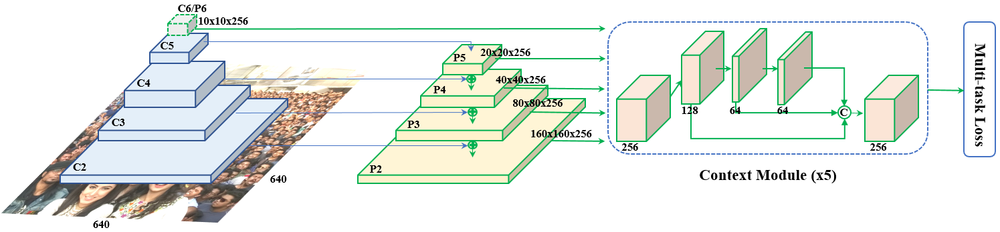
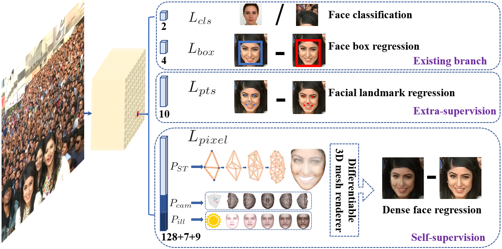
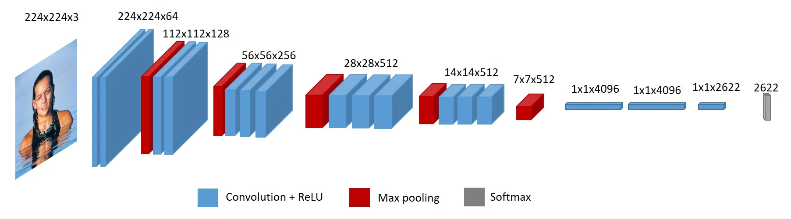

# Report - Face recognition

# 0 Team Member and Contribution

|Team Member|SID|Contribution|
| :-----------: | :--------: | :------------: |
|刘一凡|12210912|27%|
|杨博乔|12112805|27%|
|王炳臻|12010113|23%|
|程嘉朗|12111622|23%|

# 1 Introduction

人脸识别技术作为生物特征识别领域的核心技术之一，已在现代社会中扮演着日益重要的角色。从智能手机解锁、移动支付等日常应用，到访问控制、公共安全监控和身份认证等专业领域，该技术都提供了高效、自然且非接触式的解决方案。其核心在于通过计算机视觉技术，分析数字图像或视频中的人脸特征，并将其与数据库中的已知人脸进行比对，从而实现个体身份的识别与验证。

本报告详细介绍了一个基于Python环境、利用VGG-Face2数据集[[1]](#vggface2)和DeepFace深度学习框架[[3]](#deepface)所构建的人脸识别系统。我们实现了从数据预处理、模型构建到性能评估的完整开发流程，旨在探索和展示现代深度学习模型在人脸识别任务中的强大能力。

本项目的核心目标具体如下：

1. **构建与预处理数据集**：从大规模的VGG-Face2数据集中筛选并构建一个合理、可用的训练与测试子集，以适应项目开发的需求。
2. **实现人脸识别模型**：利用DeepFace框架封装的先进的预训练模型（如VGG-Face用于特征提取）和高精度的人脸检测器（如RetinaFace），创建一个功能强大的人脸识别与验证系统。
3. **系统性能综合评估**：设计并执行全面的测试方案，使用正样本（数据库内已知个体）和负样本（数据库外未知个体）对系统的准确率、召回率等关键指标进行量化评估。
4. **确定最佳识别阈值**：通过分析系统在不同距离阈值下的表现，找到一个能够在识别准确性（True Positive Rate）和误报率（False Positive Rate）之间取得最佳平衡的阈值，以确保系统的可靠性。
5. **探讨系统在面对高级AI攻击时的脆弱性**：尝试使用**生成对抗网络（GAN）** 生成一个“数字面具”来挑战系统。

通过完成以上目标，本项目不仅旨在创建一个高效、准确的人脸识别原型系统，还通过对抗实验证明了系统在高级AI攻击下的脆弱性，更希望为理解和应用此类技术提供一个清晰的实践范例。本报告的后续章节将依次介绍相关的核心技术，详细阐述系统设计方法与实现细节，展示并分析实验结果，最后对整个项目进行总结。

# 2 Related work

本项目的实现建立在若干业界领先的人脸数据集、深度学习框架和算法的基础之上。这些工具和技术共同构成了现代人脸识别系统的基石。本章节将对这些核心技术进行详细介绍。

## 2.1 VGG-Face2数据集

VGG-Face2 是由牛津大学视觉几何组（Visual Geometry Group, VGG）于2017年发布的一个大规模人脸图像数据集，是人脸识别领域最重要和最广泛使用的基准之一。该数据集的创建旨在推动不受约束环境下（in-the-wild）的人脸识别技术研究。

VGG-Face2数据集的特点包括大规模与多样，标注质量高。VGG-Face2包含约331万张图像，涵盖9131个不同的身份个体，平均每个个体拥有约362张照片。这些图像采集自互联网，具有极高的多样性，涵盖了不同年龄、姿态、光照条件、表情、遮挡和分辨率的挑战，这使其非常适合训练能够适应真实世界复杂场景的深度学习模型。数据集经过精心筛选和清理，确保了每个身份下图像的准确性。同时，数据集提供了详细的元数据，包括面部边界框和关键点标注，为监督学习提供了精确的标签信息。

在本项目中，我们利用VGG-Face2的子集作为系统的“已知身份”数据库，其丰富性和挑战性为评估我们系统的性能提供了坚实的基础。

## 2.2 DeepFace框架

DeepFace 是一个为Python开发者设计的轻量级、开源的人脸识别与面部属性分析框架。它极大地简化了在Python应用中集成先进人脸识别功能的过程。DeepFace将当前最主流的深度学习模型和算法封装在统一的API后，使得开发者无需深入了解底层复杂的模型结构即可轻松调用。

DeepFace封装了多种业界顶尖的预训练人脸识别模型，如VGG-Face、Google Facenet、Facebook DeepFace、ArcFace等，用户可以根据需求灵活选择。功能上，除了核心的人脸验证和识别功能，它还支持面部属性分析，能够检测年龄、性别、情绪和种族等信息。DeepFace同时支持多种人脸检测后段，如OpenCV、YOLO及本项目中所使用的RetinaFace，这允许了速度和精度之间的权衡。

在本项目中，DeepFace作为核心开发工具，我们利用其便捷的接口调用RetinaFace寻找并对齐人脸并使用VGG-Face模型进行特征向量提取，从而显著加快了开发周期。

## 2.4 RetinaFace人脸检测模型

RetinaFace[[2]](#retinaface)是一个先进的、基于深度学习的单阶段人脸检测模型，以其在真实图像上的高精度检测能力而闻名。与传统检测器相比，RetinaFace不仅能检测各种尺寸和姿态的人脸，还能在存在部分遮挡、模糊和极端光照等挑战性条件下保持优异性能。

RetinaFace在一个统一的框架内同时完成人脸边界框预测、5个关键面部特征点（双眼中心、鼻尖、嘴角）定位以及3D面部重建。通过监督学习和自监督学习的结合，RetinaFace能够非常精确地定位面部区域和关键点。RetinaFace的多任务损失函数设计使其在检测精度和速度上都表现出色，适用于实时应用场景。其网络结构基于ResNet和FPN，能够有效处理不同尺度的人脸。  
​  
​​

在本项目的工作流程中，RetinaFace扮演着至关重要的预处理角色。在进行特征提取之前，我们首先使用RetinaFace来准确定位图像中的人脸。其精确的边界框和关键点信息保证了后续人脸对齐和裁剪的质量，这对于提升VGG-Face模型的识别准确率至关重要。

## 2.3 VGG-Face人脸识别模型

VGG-Face[[4]](#vggface)是由牛津大学VGG团队提出的一种基于深度卷积神经网络（CNN）的人脸识别模型。该模型结构基于经典的VGG-16网络，并通过在早期的大规模人脸数据集（VGG-Face）上进行训练，使其能够学习到用于区分不同人脸身份的丰富、稳健的特征表示。

VGG-Face将一张输入的人脸图像通过深度网络，最终在前馈过程的末端生成一个高维的特征向量（即“embedding”）。这个向量可以被视为该人脸在特征空间中的一个独特坐标。在理想情况下，来自同一个体的不同照片所生成的特征向量在空间中会彼此靠近，而来自不同个体的向量则会相互远离。因此，通过计算两个特征向量之间的距离（如欧氏距离），就可以量化两个人脸的相似度。

​

在我们的系统中，VGG-Face模型是实现人脸识别的核心引擎，负责将人脸图像转化为可供比较的、标准化的特征向量。

# 3 Approach

Repository: [52hutao1314/cv_project](https://github.com/52hutao1314/cv_project)

### 流程图

​

### 3.1 数据集准备

VGG Face2提供了包含9,131个人物共3,310,000余张图片的大规模数据集，但数量庞大，直接使用会导致计算资源耗费过大，因此我们采用**分层抽样**的方法构建适合实验的小规模数据集，具体步骤如下：

1. 从所有9,131个身份中随机选取1,000个作为基础子集。
2. 对每个身份随机选取10张不同的图像。
3. 构建训练集包含10,000张图片。
4. 构建测试集包含2,000张图片：其中1,000张为训练集中人物的不同图像，作为正样本；另外1,000张为训练集之外人物的图片，作为负样本。

这样划分保证了训练和测试的公平性，以及测试集中正负样本的均衡。

---

### 3.2 特征提取

采用DeepFace框架的VGG-Face模型进行特征提取，主要步骤包括：

1. **人脸检测**：使用`RetinaFace`​检测图片中的人脸，并返回人脸框（`bbox`​）和关键点（如眼睛、鼻子、嘴角等）。
2. **对齐**：根据检测到的关键点（如双眼位置）自动旋转人脸，使其水平对齐（这能提高后续特征提取的准确性）。
3. **裁剪人脸区域**：根据检测到的 `bbox`​ 裁剪出人脸区域。
4. **生成特征向量**：根据裁剪出人脸区域，再输入到指定的模型生成特征向量。

---

### 3.3 构建特征库

针对训练集中的每个身份，提取所有图像的特征向量后进行组织：

1. 对每张训练图像分别提取特征向量。
2. 按身份ID或标签将其对应特征向量聚合。
3. 计算每个人的特征均值向量（mean）和特征方差（variance），反映身份的典型特征和变化范围。
4. 将计算结果序列化存储为二进制文件，方便快速加载和匹配。

---

### 3.4 识别流程

1. **生成** **​**​**​`embedding`​**​**​**​ **特征向量**：与构建特征库中同样的步骤生成输入图片的特征向量。
2. **计算与特征库的相似度**：计算输入图片的embedding与特征库中各个人物所有图片特征的平均**欧氏距离**与标准差   **。**
3. **计算置信度**：采用 **归一化 + 标准差加权** 的方式计算置信度，如果 `mean_distance`​ 接近 `min_d`​，则置信度接近 `1`​；如果 `std_distance`​ 较大，则置信度降低（表示该文件夹内人脸差异大）。

    $$
    \text{confidence} = (1 - \hat{d}) \cdot p = (1 - \frac{d - d_{\min}}{d_{\max} - d_{\min}}) \cdot e^{-\lambda \cdot \sigma}
    $$

    其中：

    - p 是惩罚因子（penalty）
    - λ 是给定的参数
    - σ 是标准距离（std\_dist）
    - d 是当前距离（distance）
    - dmin 和 dmax 是最小和最大距离
    - $\hat{d}$是归一化后的距离
4. **排序并返回最相似结果**：最终返回 **最相似人物** 及其 **置信度比率**​**​**​**​`confidence_ratio`​**​**​**​ 和 **平均距离**​**​**​**​`distance`​**​**​**​，
    ​**​**​**​`confidence_ratio`​**​**​**​ 衡量 **第一名和第二名的差距是否显著**（值越大，识别越可靠）。
    ​**​**​**​`distance`​**​**​**​ 是查询图片与最相似文件夹的平均距离。
    这两个数据用于后续评估中阈值过滤。
5. 结合置信度比率和距离阈值，判断识别结果是否可靠。

---

### 3.5 评估流程

为了评估识别系统的性能，采用如下评价策略：

1. **正样本识别**：正确识别且置信度比率和距离达到阈值判定为`TP`，否则判为`FN`。
2. **负样本识别**：判定为数据库内人物（置信度阈值通过）错误识别为`FP`，未通过阈值判为`TN`。
3. 采用**F0.5-score**作为评价指标，强调精度(Precision)比召回率(Recall)更重要，适合安全场景下防止误识别外部人员。

$$
F_{0.5} = (1+0.5^2) \cdot \frac{\text{Precision} \cdot \text{Recall}}{0.5^2 \cdot \text{Precision} + \text{Recall}}
$$

4. 通过调整置信度比率阈值和距离阈值，寻找最大化F0.5-score的最佳参数。

# 4 Experimental results

### 4.1 置信度比率阈值法

1. 正负例在**​**​**​`confidence_ratio`​**​**​**​上的分布：

    ​
2. 最佳阈值: 3.7064

    - `F0.5-score`: 0.6355
    - `Precision`: 0.6430, `Recall`: 0.6070
    - `TP`: 607, `FP`: 337, `FN`: 393, `TN`: 663
3. PR曲线

    ​

### 4.2 距离阈值法

1. 正负例在**​**​**​`distance`​**​**​**​上的分布：

    ​
2. 最佳阈值: 1.1285

    - `F0.5-score`: 0.8576
    - `Precision`: 0.9217, `Recall`: 0.6710
    - `TP`: 671, `FP`: 57, `FN`: 329, `TN`: 943
3. PR曲线

    ​

### 4.3 结果分析

1. 距离阈值法在 F0.5-score 方面表现更优
2. 主要错误集中在：

    - 极端姿态（侧脸角度\>45度）、

      ​
    - 严重遮挡（口罩、墨镜等）

      ​
    - 低质量图像（模糊、过曝）

      ​
    - 非单人图像（图片中有超过1个人）

      ​

# 5 Adversarial Attack and System Vulnerability

在评估了系统在标准数据集上的性能后，我们进一步探究了其在面对蓄意攻击时的稳健性。具体而言，我们研究了利用生成对抗网络（Generative Adversarial Networks, GANs）生成特定身份的合成图像（即“假脸”），以期欺骗或绕过本报告所构建的人脸识别系统。

#### **5.1 对抗攻击模型设计**

我们设计了一个生成对抗网络，其核心目标是生成一个特定身份 n 的面部图像，该图像不仅在视觉上逼真，还能在特征空间中与身份 n 的真实图像足够接近，从而被我们的识别系统错误地认证为 TP（True Positive）。

该模型由两个关键部分组成：生成器 G 和判别器 D。

- **生成器 (Generator)**  G：其任务是将一个从先验分布（如高斯分布）中采样的随机噪声向量 z 映射到一个图像空间，即生成一张伪造图像 G(z)。
- **判别器 (Discriminator)**  D：其任务是一个标准的二元分类器，用于区分真实图像 x 和由生成器产生的伪造图像 G(z)。

为了使生成的图像具备特定身份 n 的特征，我们引入了一个复合损失函数来训练生成器 G。生成器的总损失 LG 由两部分构成：对抗性损失 Ladv 和身份损失 Lidentity。

1. **对抗性损失** Ladv: 此损失函数驱使生成器产生让判别器 D 无法区分真伪的图像。其数学表达如下：$Ladv=−Ez∼pz(z)$​$[$​$logD(G(z))$​$]$  
    其中，E 表示期望值，生成器 G 的目标是最小化此损失，等价于最大化判别器犯错的概率。
2. **身份损失** Lidentity: 此损失函数是本次攻击成功的关键。它度量了生成的假脸图像 G(z) 与目标身份 n 在FaceNet特征空间中的相似性。我们首先计算出目标身份 n 的平均特征向量 Etarget。然后，我们使用系统中冻结的FaceNet模型作为特征提取器 R(⋅)，计算生成图像的特征向量 R(G(z))。身份损失定义为这两个向量之间的欧氏距离（L2 范数）的平方：$Lidentity=∥R(G(z))−Etarget∥^2$

生成器的最终优化目标是最小化这两个损失的加权和：

$L_G=Ladv+λ⋅Lidentity$  

其中，λ 是一个超参数，用于平衡生成图像的视觉真实性与身份相似性。  
判别器 D 的损失函数 LD 采用标准的二元交叉熵损失：

$L_D=−Ex∼pdata(x)$​$[$​$logD(x)$​$]$​$−Ez∼pz(z)$​$[$​$log(1−D(G(z)))$​$]$  

#### **5.2 两阶段训练策略与结果**

在实验中我们发现，一个关键的结论是：**生成器** G **不能在训练初期就直接针对一个固定的（frozen）人脸识别模型（即我们的FaceNet特征提取器** R **）进行优化。**  若直接使用 Lidentity 进行端到端训练，由于初始生成器产生的图像质量极差（基本为纯噪声），其特征向量在空间中是随机且无意义的，导致梯度信号极其稀疏和不稳定，模型无法收敛。

因此，我们设计了一种**两阶段训练策略**：

1. **第一阶段：协同演化**。在训练的前半段周期（例如，前N/2个epochs），我们同时训练生成器 G 和判别器 D，采用经典的GAN最小-最大博弈（min-max game）框架进行优化：minGmaxDV(G,D)。在此阶段，身份损失 Lidentity 也被引入，但其主要作用是轻微地引导生成方向。这个协同演化过程使生成器首先学会如何产生结构正确、视觉上逼真的人脸，即掌握了“人脸”这一基本的数据流形（data manifold）。
2. **第二阶段：目标攻击**。在训练的后半段周期，我们**冻结并弃用判别器** D。此时，生成器已经具备了稳定生成人脸的能力。我们将其训练目标完全切换为最小化身份损失 Lidentity。生成器此时的任务不再是欺骗一个通用的判别器，而是专注于微调其输出，使其在特征空间中无限逼近目标身份 Etarget，从而绕过我们系统的验证。

通过此策略，我们成功生成了能够欺骗系统的合成图像。

​

通过两阶段对抗性训练生成的合成人脸图像。该图像在我们的识别系统中被成功识别为目标身份n，其与特征库的距离低于我们设定的最佳阈值，从而成功实现了绕过。  
这一实验结果明确表明，仅依赖于特征空间距离的静态人脸识别系统，在面对适应性、生成式的对抗攻击时存在固有的脆弱性。

# 6 Conclusion

‍本文基于VGG-Face和RetinaFace实现了一套端到端的人脸识别系统。通过分层抽样构建数据集，设计有效的特征库构建和置信度计算方法。实验结果表明，基于欧氏距离的阈值方法在识别准确率和安全性上均表现优异，适用于实际应用场景。未来工作可进一步优化姿态和遮挡处理，提高系统的泛化能力。

# References

[1] Cao, Q., Shen, L., Xie, W., Parkhi, O. M., & Zisserman, A. (2018, May). Vggface2: A dataset for recognising faces across pose and age. In 2018 13th IEEE 	  international conference on automatic face & gesture recognition (FG 2018) (pp. 67-74). IEEE.

[2] Deng, J., Guo, J., Ververas, E., Kotsia, I., & Zafeiriou, S. (2020). RetinaFace: Single-Shot Multi-Level face localisation in the wild. 2022 IEEE/CVF Conference on Computer Vision and Pattern Recognition (CVPR). https://doi.org/10.1109/cvpr42600.2020.00525

[3] Serengil, S. I., & Ozpinar, A. (2020). LightFace: a Hybrid Deep Face Recognition framework. 2022 Innovations in Intelligent Systems and Applications Conference (ASYU), 1–5. https://doi.org/10.1109/asyu50717.2020.9259802

[4] Parkhi, O., Vedaldi, A., & Zisserman, A. (2015). Deep face recognition. In BMVC 2015-Proceedings of the British Machine Vision Conference 2015. British Machine Vision Association.

‍

‍
