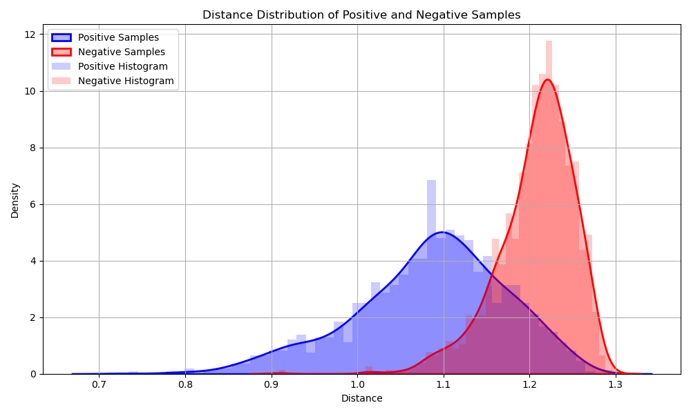

# Report - Face recognition

# 0 Team Member and Contribution

‍

# 1 Introduction

人脸识别技术已成为现代认证系统、安全应用和个人设备访问控制中日益普遍的技术。本报告介绍了使用VGG-Face2数据集和DeepFace框架开发的人脸识别系统。该系统通过将人脸特征与已知个体的数据库进行匹配来验证用户身份，实现了从数据准备到性能评估的完整流程。

本项目的主要目标是：

1. 从庞大的VGG-Face2数据集中创建可管理的子集以提高处理效率
2. 使用DeepFace的预训练模型实现人脸识别系统
3. 使用正样本(已知个体)和负样本(未知个体)测试用例评估系统性能
4. 确定可靠识别的最佳阈值

# 2 Related work

‍

# 3 Approach

### 流程图

### 3.1 数据集准备

VGG Face2提供了包含9,131个人物共3,310,000余张图片的大规模数据集，但数量庞大，直接使用会导致计算资源耗费过大，因此我们采用**分层抽样**的方法构建适合实验的小规模数据集，具体步骤如下：

1. 从所有9,131个身份中随机选取1,000个作为基础子集。
2. 对每个身份随机选取10张不同的图像。
3. 构建训练集包含10,000张图片。
4. 构建测试集包含2,000张图片：其中1,000张为训练集中人物的不同图像，作为正样本；另外1,000张为训练集之外人物的图片，作为负样本。

这样划分保证了训练和测试的公平性，以及测试集中正负样本的均衡。

---

### 3.2 特征提取

采用DeepFace框架的VGG-Face模型进行特征提取，主要步骤包括：

1. **人脸检测**：使用`RetinaFace`​检测图片中的人脸，并返回人脸框（`bbox`​）和关键点（如眼睛、鼻子、嘴角等）。
2. **对齐**：根据检测到的关键点（如双眼位置）自动旋转人脸，使其水平对齐（这能提高后续特征提取的准确性）。
3. **裁剪人脸区域**：根据检测到的 `bbox`​ 裁剪出人脸区域。
4. **生成特征向量**：根据裁剪出人脸区域，再输入到指定的模型生成特征向量。

---

### 3.3 构建特征库

针对训练集中的每个身份，提取所有图像的特征向量后进行组织：

1. 对每张训练图像分别提取特征向量。
2. 按身份ID或标签将其对应特征向量聚合。
3. 计算每个人的特征均值向量（mean）和特征方差（variance），反映身份的典型特征和变化范围。
4. 将计算结果序列化存储为二进制文件，方便快速加载和匹配。

---

### 3.4 识别流程

1. **生成** **​`embedding`​**​ **特征向量**：与构建特征库中同样的步骤生成输入图片的特征向量。
2. **计算与特征库的相似度**：计算输入图片的embedding与特征库中各个人物所有图片特征的平均**欧氏距离**与标准差  **。**
3. **计算置信度**：采用 **归一化 + 标准差加权** 的方式计算置信度，如果 `mean_distance`​ 接近 `min_d`​，则置信度接近 `1`​；如果 `std_distance`​ 较大，则置信度降低（表示该文件夹内人脸差异大）。

    $$
    \text{confidence} = (1 - \hat{d}) \cdot p = (1 - \frac{d - d_{\min}}{d_{\max} - d_{\min}}) \cdot e^{-\lambda \cdot \sigma}
    $$

    其中：

    - p 是惩罚因子（penalty）
    - λ 是给定的参数
    - σ 是标准距离（std\_dist）
    - d 是当前距离（distance）
    - dmin 和 dmax 是最小和最大距离
    - $\hat{d}$是归一化后的距离
4. **排序并返回最相似结果**：最终返回 **最相似人物** 及其 **置信度比率**​**​`confidence_ratio`​**​ 和 **平均距离**​**​`distance`​**​，  
    ​**​`confidence_ratio`​**​ 衡量 **第一名和第二名的差距是否显著**（值越大，识别越可靠）。  
    ​**​`distance`​**​ 是查询图片与最相似文件夹的平均距离。  
    这两个数据用于后续评估中阈值过滤。
5. 结合置信度比率和距离阈值，判断识别结果是否可靠。

---

### 3.5 评估流程

为了评估识别系统的性能，采用如下评价策略：

1. **正样本识别**：正确识别且置信度比率和距离达到阈值判定为`TP`，否则判为`FN`。
2. **负样本识别**：判定为数据库内人物（置信度阈值通过）错误识别为`FP`，未通过阈值判为`TN`。
3. 采用**F0.5-score**作为评价指标，强调精度(Precision)比召回率(Recall)更重要，适合安全场景下防止误识别外部人员。

$$
F_{0.5} = (1+0.5^2) \cdot \frac{\text{Precision} \cdot \text{Recall}}{0.5^2 \cdot \text{Precision} + \text{Recall}}
$$

4. 通过调整置信度比率阈值和距离阈值，寻找最大化F0.5-score的最佳参数。

# 4 Experimental results

### 4.1 置信度比率阈值法

1. 正负例在**​`confidence_ratio`​**​上的分布：

    ​
2. 最佳阈值: 3.7064  
    
    - `F0.5-score`: 0.6355  
    - `Precision`: 0.6430, `Recall`: 0.6070  
    - `TP`: 607, `FP`: 337, `FN`: 393, `TN`: 663
3. PR曲线

    ​

### 4.2 距离阈值法

1. 正负例在**​`distance`​**​上的分布：

    ​
2. 最佳阈值: 1.1285  
    F0.5-score: 0.8576  
    Precision: 0.9217, Recall: 0.6710  
    TP: 671, FP: 57, FN: 329, TN: 943
3. PR曲线

    ​

### 4.3 结果分析

1. 距离阈值法在 F0.5-score 方面表现更优
2. 主要错误集中在：

    - 极端姿态（侧脸角度\>45度）、

      
    - 严重遮挡（口罩、墨镜等）

      
    - 低质量图像（模糊、过曝）

      
    - 非单人图像（图片中有超过1个人）

      ​

# 5 Conclusion

‍本文基于VGG-Face和RetinaFace实现了一套端到端的人脸识别系统。通过分层抽样构建数据集，设计有效的特征库构建和置信度计算方法。实验结果表明，基于欧氏距离的阈值方法在识别准确率和安全性上均表现优异，适用于实际应用场景。未来工作可进一步优化姿态和遮挡处理，提高系统的泛化能力。

# References

‍
